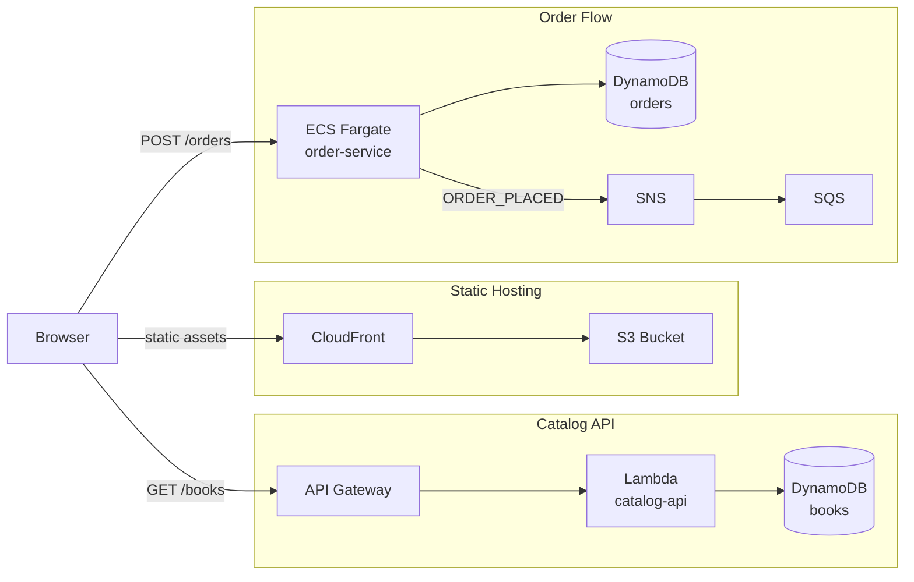

[](https://github.com/richardokafor-rgb/localstack-bookstore/actions/workflows/ci.yml)

# LocalStack Bookstore

A full-stack bookstore application running entirely on [LocalStack](https://localstack.cloud) — an AWS emulator for local development.


## Architecture

| Layer | Technology |
|-------|------------|
| Frontend | React + Vite (S3/CloudFront) |
| Catalog API | Node.js Lambda + API Gateway |
| Order Service | Python ECS container |
| Database | DynamoDB |
| MCP Skill | Python MCP server |



Infrastructure is managed with Terraform via `tflocal`.

---

## Quick start

```bash
# 1. Start LocalStack Pro (skip if already running)
localstack start

# 2. Deploy all infrastructure, build the frontend, and seed 6 books (~60–90 s)
cd infrastructure
make reset

# 3. Start the Flask order service on port 5001
make start-order-service

# 4. Open the app
```

The frontend is deployed to LocalStack CloudFront/S3 as part of `make reset`. Get the URL:

```bash
cd infrastructure && make output   # prints cloudfront_url
```

Or run the Vite dev server for hot-reload development:

```bash
cd ../frontend && npm install && npm run dev
# → http://localhost:5173
```

---

## Prerequisites

- [LocalStack Pro](https://localstack.cloud) running on `localhost:4566`
- `terraform` / `tflocal`
- `lstk` (LocalStack CLI)
- Node.js 18+, Python 3.12+

---

## Workflows

### Fresh setup

Run this after the very first clone, or any time you want a clean slate:

```bash
cd infrastructure
make reset
```

This nukes all existing resources, re-applies Terraform from scratch, and seeds the database with 6 books. Takes ~60–90 seconds.

### Fast restore with Cloud Pods

If you previously saved a pod (see below), you can restore the full environment in seconds instead of re-deploying everything:

```bash
cd infrastructure
make pod-load
```

This restores all AWS resources (DynamoDB tables, Lambda, API Gateway, ECS, S3 buckets) from the saved snapshot, then regenerates `frontend/.env.local` and `.mcp.json` with the current API endpoint.

---

## Cloud Pod commands

| Command | Description |
|---------|-------------|
| `make pod-save` | Snapshot current LocalStack state as `bookstore-dev` |
| `make pod-load` | Restore `bookstore-dev` snapshot and refresh local config |
| `make pod-list` | List all available Cloud Pods |

Save a pod after a successful `make reset` so future restores are instant:

```bash
cd infrastructure
make reset       # full deploy + seed
make pod-save    # snapshot it
```

Next time LocalStack restarts:

```bash
cd infrastructure
make pod-load    # ~seconds, no Terraform run needed
```

---

## Running the frontend

`make reset` (and `make pod-load`) automatically build the React app and upload it to the LocalStack S3 bucket served by CloudFront. Get the URL after deployment:

```bash
cd infrastructure && make output   # look for cloudfront_url
```

For hot-reload development, run the Vite dev server alongside the deployed stack:

```bash
cd frontend
npm install
npm run dev   # → http://localhost:5173
```

---

## Running the tests

Install dependencies and run the full integration suite:

```bash
pip3 install -r tests/requirements.txt
pytest tests/integration/ -v
```

30 tests across four areas:

| Suite | What it covers |
|-------|---------------|
| `test_catalog.py` | Catalog CRUD via API Gateway + Lambda |
| `test_orders.py` | Order flow — DynamoDB, SQS, SNS |
| `test_mcp_skill.py` | MCP tool registry and end-to-end tool calls |
| *(infra assertions in conftest)* | DynamoDB tables, queues, and topics exist |

Tests resolve the API Gateway endpoint dynamically from LocalStack, so they work after any restart without editing config.

---

## MCP Skill

The repo ships a [Model Context Protocol](https://modelcontextprotocol.io) skill at `services/mcp-skill/server.py` that exposes three tools:

| Tool | What it does |
|------|-------------|
| `get_catalog` | Fetches the live book catalog from API Gateway + Lambda |
| `place_order` | Triggers the full Lambda → SNS → SQS → ECS order flow |
| `check_order_status` | Queries DynamoDB directly for the status of an order |

### Connecting via Claude Code

The repo root contains a `.mcp.json` that wires the skill into Claude Code automatically. After `make reset` or `make pod-load`, the file is updated with the current API endpoint. To connect:

1. Open this repo in Claude Code.
2. Claude Code reads `.mcp.json` and starts the MCP server automatically.
3. Ask Claude to list the catalog, place an order, or check an order status — it will call the live LocalStack infrastructure.

To refresh the endpoint after a LocalStack restart without a full redeploy:

```bash
cd infrastructure
bash scripts/update-mcp-config.sh
```

---

## Makefile reference

All targets run from the `infrastructure/` directory.

| Target | Description |
|--------|-------------|
| `make reset` | Full redeploy: nuke → init → apply → seed (~60–90 s) |
| `make start-order-service` | Start the Flask order service locally on port 5001 |
| `make pod-save` | Snapshot current LocalStack state as `bookstore-dev` |
| `make pod-load` | Restore `bookstore-dev` snapshot and refresh local config |
| `make pod-list` | List all available Cloud Pods |
| `make init` | `terraform init` |
| `make plan` | `terraform plan` |
| `make apply` | `terraform apply` |
| `make destroy` | `terraform destroy` |
| `make nuke` | Delete all bookstore resources from LocalStack |
| `make output` | Print Terraform outputs (includes `api_endpoint`) |
